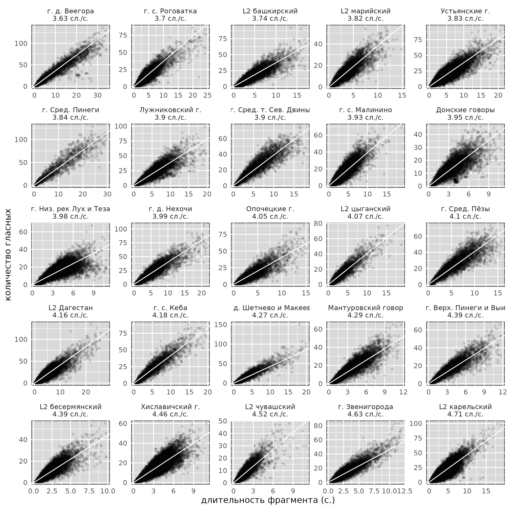
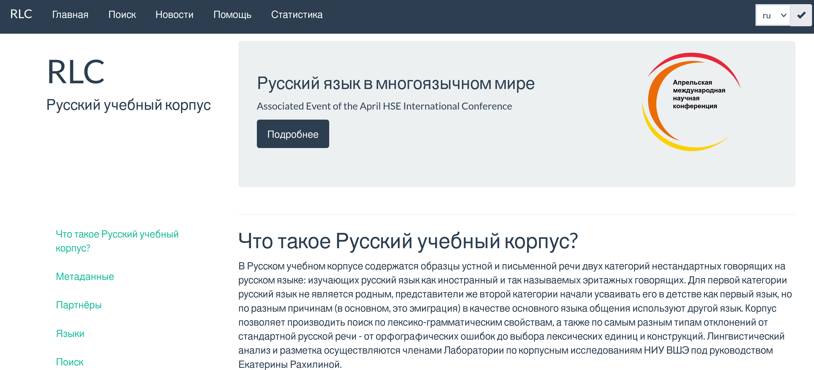

```{r, include=FALSE}
knitr::opts_chunk$set(echo = FALSE, warning = FALSE, message = FALSE, dev='cairo_pdf', fig.align='center', fig.show='hold', out.width='99%')
# setwd("/home/agricolamz/work/materials/2023.12.14_4nv")
library(tidyverse)
library(treemapify)
theme_set(theme_minimal()+theme(text = element_text(size = 16), legend.position = "bottom"))
```

#  О международной лаборатории языковой конвергенции

## Международная лаборатория языковой конвергенции

- Открыта в 2017 году

```{r, out.width="40%", fig.cap="Н. Р. Добрушина и Дж. Николс", fig.show='hold', fig.align='center'}
knitr::include_graphics("images/01_dobrushina.jpg")

```

Оба исследователя специализируются на славянских языках и языках Кавказа, а также лингвистической типологии

## Миссия

Исследование механизмов конвергентных процессов в истории языка, то есть языковых ситуаций, при которых контакт между носителями разных языков ведет к появлению у этих языков общих черт. В лаборатории разрабатываются инструменты для выявления результатов таких процессов по данным электронных корпусов устной речи и создаются каталоги таких явлений на материале малых языков России.

## Ресурсы международной лаборатории языковой конвергенции

- lingconlab.ru
- 22 устных корпуса диалектов русского языка
- 8 устных корпусов русского языка билингвов
- 10 корпусов малых языков
- другие
    - словари (мегебский, рутульский, тукитинский, хваршинский, даргинский)
    - Типологический атлас языков Дагестана
    - Атлас многоязычия в Дагестане
    - Атлас рутульских диалектов
    - Корпус Просодии Русских Диалектов (ПРуД)
    - ...

## 22 устных диалектных корпуса

```{r}
resources <- read_tsv("/home/agricolamz/work/bureaucracy/linguistic_convergency/LABsite/data/corpora_villages.tsv")
resources |> 
  filter(subtype == "dialectal",
         name_ru != "Корпус просодии русских диалектов") |> 
  distinct(name_ru, n_tokens) |> 
  mutate(n_tokens = str_remove(n_tokens, "&nbsp;"),
         n_tokens = str_remove(n_tokens, "~"),
         n_tokens = as.double(n_tokens),
         name_ru = str_c(name_ru, "\n", formatC(n_tokens, format="f", big.mark=",", digits=0), " ток.")) |> 
  arrange(-n_tokens) |> 
  ggplot(aes(area = n_tokens, label = name_ru))+
  geom_treemap(fill = "white", color = "black", size = 5) +
  geom_treemap_text()
```

## 22 устных диалектных корпуса

```{r, out.width='71%'}
knitr::include_graphics("images/01_dialects.png")
```
  
```{r, eval=FALSE}
resources |> 
  filter(subtype == "dialectal",
         name_ru != "Корпус просодии русских диалектов") ->
  d

library(leaflet)
leaflet(sf::st_read("data/dialects.json")) |>
  addTiles() |> 
  addPolygons(stroke = FALSE, smoothFactor = 0.3, fillOpacity = 0.5,
              fillColor = ~color) |> 
  addCircleMarkers(
    lng = d$lon,
    lat = d$lat,
    radius = 3,
    opacity = 1,
    fillOpacity = 1,
    popupOptions = leaflet::popupOptions(maxWidth = 700),
    labelOptions = leaflet::labelOptions(
        noHide = FALSE,
        textOnly = TRUE,
        direction = "center")) 
```

## 8 устных билингавльных корпусов

```{r}
resources |> 
  filter(subtype == "bilingual") |> 
  distinct(name_ru, n_tokens) |> 
  mutate(n_tokens = str_remove(n_tokens, "&nbsp;"),
         n_tokens = str_remove(n_tokens, "~"),
         n_tokens = as.double(n_tokens),
         name_ru = str_c(name_ru, "\n", formatC(n_tokens, format="f", big.mark=",", digits=0), " ток.")) |> 
  arrange(-n_tokens) |> 
  ggplot(aes(area = n_tokens, label = name_ru))+
  geom_treemap(fill = "white", color = "black", size = 5) +
  geom_treemap_text()
```

## 8 устных билингавльных корпусов

```{r}
knitr::include_graphics("images/02_bilinguals.png")
```

```{r, eval=FALSE}
resources |> 
  filter(subtype == "bilingual") |> 
  select(lat, lon) ->
  b
library(lingtypology)
map.feature(languages = "Russian",
            latitude = b$lat,
            longitude = b$lon)
```

## 12 корпусов малых языков

```{r}
resources |> 
  filter(subtype == "minority",
         name_ru != "База данных примеров андийских словарей") |> 
  distinct(name_ru, n_tokens) |> 
  mutate(n_tokens = str_remove(n_tokens, "&nbsp;"),
         n_tokens = str_remove(n_tokens, "~"),
         n_tokens = as.double(n_tokens),
         name_ru = str_c(name_ru, "\n", formatC(n_tokens, format="f", big.mark=",", digits=0), " ток.")) |> 
  arrange(-n_tokens) |> 
  ggplot(aes(area = n_tokens, label = name_ru))+
  geom_treemap(fill = "white", color = "black", size = 5) +
  geom_treemap_text()
```

## 12 корпусов малых языков

```{r}
knitr::include_graphics("images/03_minority.png")
```

```{r, eval=FALSE}
resources |> 
    filter(subtype == "minority",
         name_ru != "База данных примеров андийских словарей") |> 
  select(lat, lon, lang) ->
  m

map.feature(languages = "Russian",
            latitude = m$lat,
            longitude = m$lon)
```

# Что делать с корпусами текстов?

## Cкорость речи [@moroz23: 382]

```{r, out.width='80%'}

```

## [Корпус просодии русских диалектов](https://lingconlab.github.io/PRuD/) [@knyazev24]

```{r}
knitr::include_graphics("images/05_PRuD.png")
```

## Исследование вариативности

```{r, out.width="24%", fig.cap="С. С. Земичева, Г. А. Мороз, К. Наккарато, А. В. Яковлева", fig.show='hold'}
knitr::include_graphics("images/sveta.jpeg")
knitr::include_graphics("images/garik.jpeg")
knitr::include_graphics("images/chiara.jpg")
knitr::include_graphics("images/nastya.jpg")
```

Грант РНФ (24-28-01097) "Исследование вариативности билингвального и диалектного русского языка на материале устных корпусов"

# Опыт зеркальной лаборатории с Южным Федеральным Университетом

## Зеркальная лаборатория с ЮФУ

- проходила 2020-2023 под руководством Елены Михайловны Севериной

```{r, out.width="30%"}

```


## Зеркальная лаборатория с ЮФУ

В рамках зеркальной лаборатории велась работа по трем направлениям:

- **Проект Digital Chekhov**: создание многоуровневой (семантической) разметки
собрания произведений А. П. Чехова
- **Устный корпус донских диалектов**: аннотация аудиозаписей и создание интерфейса устного корпуса 
- **Русский учебный корпус**: образцы устной и письменной речи нестандартных говорящих на русском языке, изучающих русский язык как иностранный

## Digital Chekhov

- <https://chekhov-digital.sfedu.ru/>

```{r, out.width="95%"}

```

## Устный корпус донских диалектов

- http://lingconlab.ru/don_rnd

```{r, out.width="98%"}

```


## Устный корпус донских диалектов

- http://lingconlab.ru/don_rnd

```{r, out.width="98%"}

```

## Русский учебный корпус

```{r, out.width="98%"}

```

## Создание тренажеров

- https://agricolamz.github.io/language_of_science_website/

```{r, out.width="98%"}

```

## Взаимодействие

- активный обмен опытом
- лекции сотрудников НИУ ВШЭ для студентов ЮФУ
- совместная конференция по цифровым гуманитарным исследованиям в 2023 году

# Потенциал Нижневартовского государственного университета

## Изучение хантыйского языка

- профиль «Хантыйская филология»
- профиль «Искусственный интеллект в моделировании речевой деятельности»

## Хантыйский и мансийский языки

- Ob-Ugric database, Германия, Университет Людвига-Максимилиана, Мюнхен. Е. К. Скрибник
- <https://www.babel.gwi.uni-muenchen.de/> \pause
- ЛингвоДок, Россия, ИСП РАН, ИЯз РАН. Норманская Ю. В., Дыбо А. В., Борисенко О.
- <http://lingvodoc.ispras.ru/corpora_all?all=&language=508%2C44> \pause
- NorthEuralex, Германия, Университет Тюбингена, Йоханнес Деллерт
- <https://link.springer.com/article/10.1007/s10579-019-09480-6> \pause
- UraTyp -- типологический ресурс из института Макса Планка
- <https://uralic.clld.org/languages>

## {}

\LARGE Спасибо за внимание!

# Литература {.allowframebreaks}